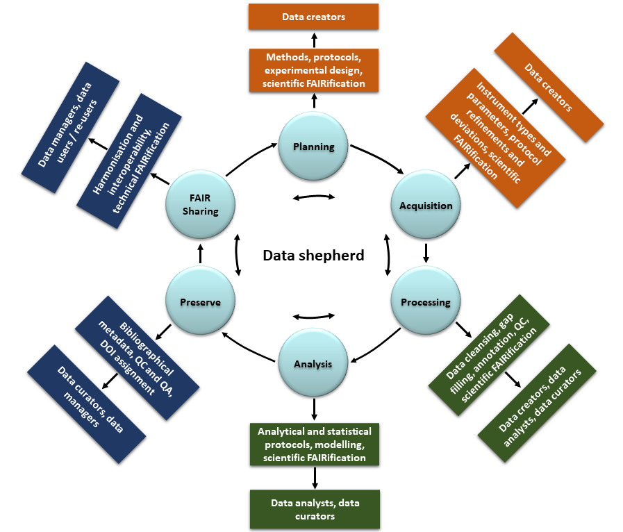

# Data management: general and nanosafety-specific aspects
{: .source }

## The data management life cycle
Based on: Papadiamantis, A.G.; Klaessig, F.C.; Exner, T.E.; Hofer, S.; Hofstaetter, N.; Himly, M.; Williams, M.A.; Doganis, P.; Hoover, M.D.; Afantitis, A.; Melagraki, G.; Nolan, T.S.; Rumble, J.; Maier, D.; Lynch, I. Metadata Stewardship in Nanosafety Research: Community-Driven Organisation of Metadata Schemas to Support FAIR Nanoscience Data. Nanomaterials 2020, 10, 2033. [https://doi.org/10.3390/nano10102033](https://doi.org/10.3390/nano10102033)

