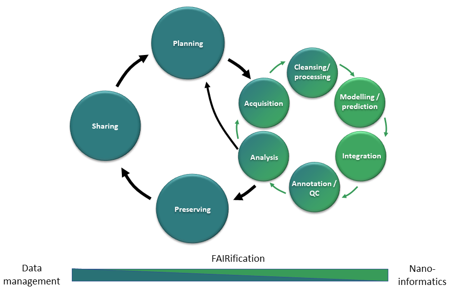

# Data and nanoinformatics shepherds’ user guidance handbook

This is an activity of **NanoCommons** or better **MaterialCommons**, not meaning the [NanoCommons project](https://nanocommons.eu) even if it started it all but in the sense of a commons for nanomaterials following the [definition from Wikipedia](https://en.wikipedia.org/wiki/Commons):
{: .lead }

_“The commons is the cultural and natural resources accessible to all members of a society, including natural materials such as air, water, and a habitable earth. These resources are held in common, not owned privately. Commons can also be understood as natural resources that groups of people (communities, user groups) manage for individual and collective benefit. Characteristically, this involves a variety of informal norms and values (social practice) employed for a governance mechanism. Commons can be also defined as a social practice of governing a resource not by state or market but by a community of users that self-governs the resource through institutions that it creates.”_

If you are a
- scientist (wet or dry lab), who produces and wants to share data
- data manager, curator or steward and want to become more
- computer geek

in the area of nanosafety, nanoinformatics or material safe-by design or want to become one, then this handbook is for you.

## Our mission
This user guidance handbook is one resource of our commons collecting and structuring knowledge and training materials for **the two strongly interlinked areas of data management for nanomaterials and nanoinformatics**. Besides covering general concepts, guidelines and recommendations, it will show, demonstrate and train real-world solutions in the form of data sources, software and workflows integrated or linked into the NanoCommons infrastructure, where both terms are meant in a very broad sense to be able to cover as many solutions as possible from all projects working in the nanosafety area and neighbouring fields.

The interrelationships can be visualised as two interlinked cycles together representing the extended data life cycle. You can hover over the figure to access short introductions to the different aspects or on the three general areas in the lower part of the figure to access general information with links to individual subareas.

## Working together
Many different research groups and projects (small and large) have and are developing data resources, software and platforms combining these. The NanoCommons infrastructure is meant to be even one level above these platforms to bring these together and gover harmonisation and interoperability aspects across platform / projects / country borders. The success is dependent on the underlying platforms and services and since not all information on this can and should be reproduced here, this will lead you to [short summaries and access links to the partnering platforms and networks]().

Information on individual tools and services including the contact points and specialised material can be found in the [service catalogue](https://infrastructure.nanocommons.eu/services/).

## A big THANK YOU to the contributing projects!

<ul class="list-style-none mt-6">

  <li class="d-inline-block mr-3 mb-3">
     
  </li>

</ul>
